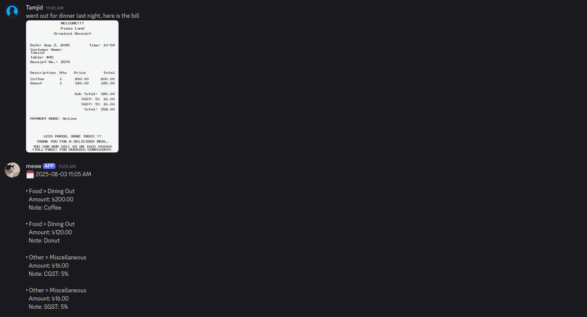
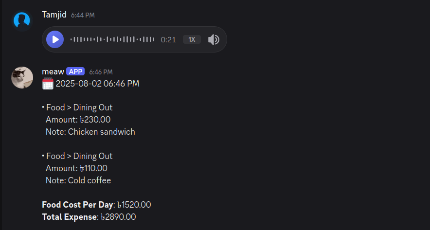
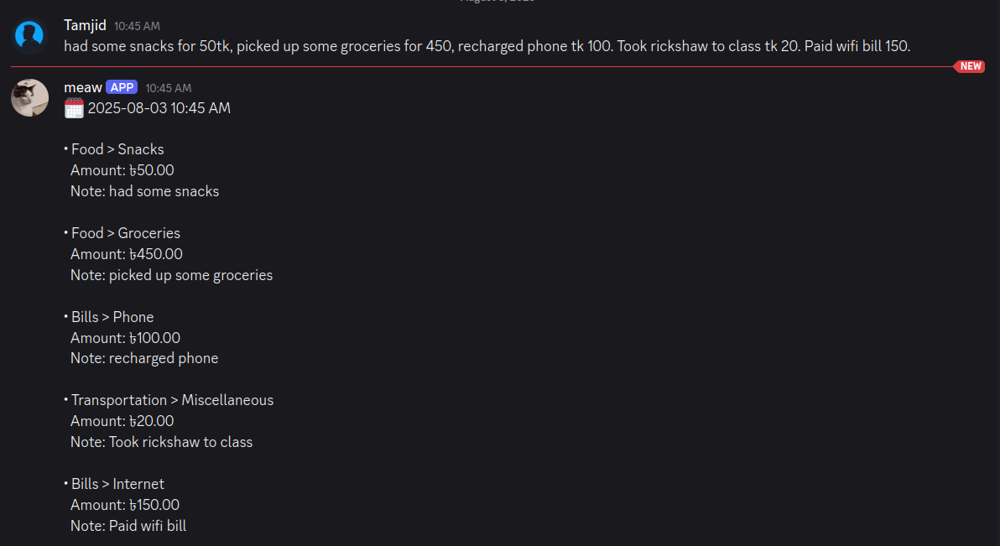
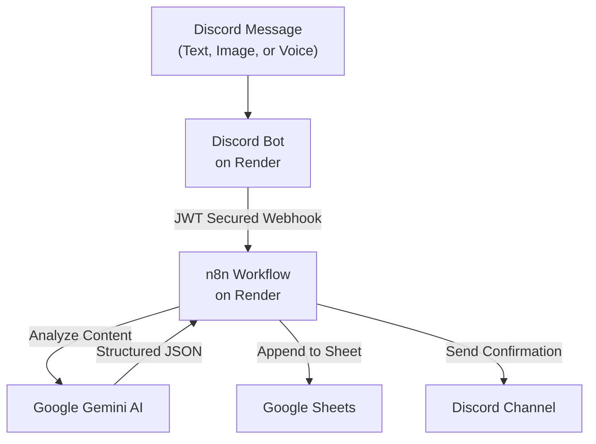
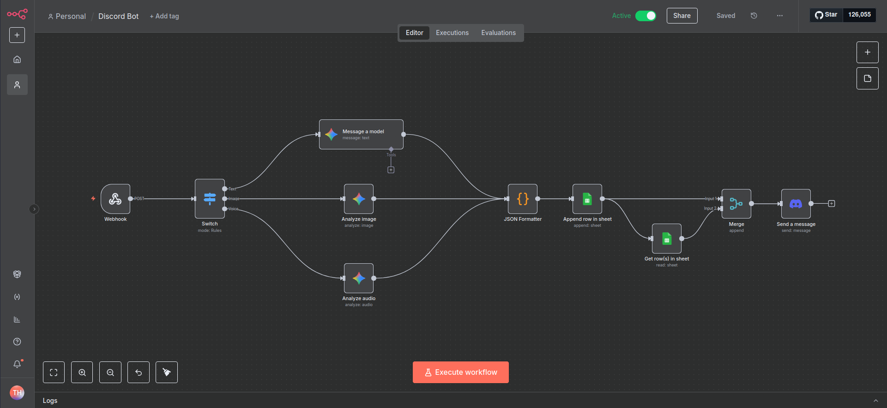
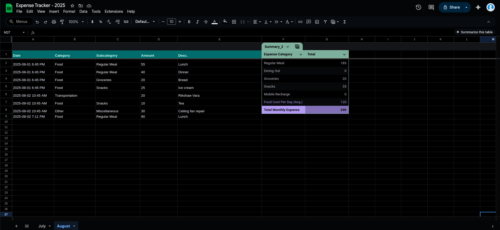
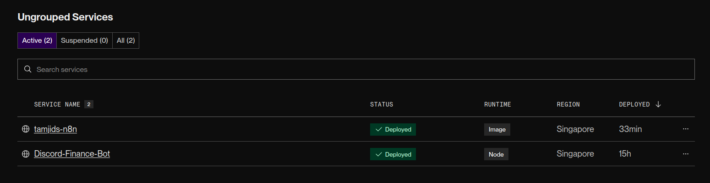

# Discord Finance Tracker Bot

A smart, AI-powered Discord bot that automatically tracks your expenses from messages, images, and voice notes, and logs them into a Google Sheet. The entire setup is designed to run on free-tier services.

## How It Works

The bot can process expenses from three types of inputs in a designated Discord channel:

| Input Type       | Example                                                                                      | Description                                                                                                                  |
| ---------------- | -------------------------------------------------------------------------------------------- | ---------------------------------------------------------------------------------------------------------------------------- |
| **Text & Image** |  | Send a message with an image of a receipt. The bot's AI will analyze the image and any accompanying text to log the expense. |
| **Voice Note**   |                  | Record a voice message describing your purchase. The bot transcribes the audio and extracts the transaction details.         |
| **Text Only**    |                    | Simply type out your expense details. The AI parses the natural language to identify the category, amount, and description.  |

### The Workflow

The process is fully automated, from message detection to data entry.



## Setup Guide

This project runs on free-tier services. Here’s how to set it up:

### 1. Discord Bot Setup

1.  **Create a Bot Application**: Go to the [Discord Developer Portal](https://discord.com/developers/applications), create a new application, and add a bot.
2.  **Enable Intents**: Under the "Bot" tab, enable the `MESSAGE CONTENT INTENT`.
3.  **Get Credentials**:
    - Copy the **Bot Token**. You will use this for the `DISCORD_TOKEN` environment variable.
    - Right-click your target channel in Discord (with Developer Mode enabled) and copy the **Channel ID**. You can also find the channel ID from the url. This will be your `TARGET_CHANNEL_ID`.
4.  **Setup OAuth2 for n8n Integration**:
    - Go to "OAuth2 > General" tab
    - Add redirect URI: `https://your-n8n-instance.onrender.com/rest/oauth2-credential/callback`
    - Copy the **Client ID** and **Client Secret** - you'll need these for n8n Discord credentials
5.  **Invite Bot**: Go to "OAuth2 > URL Generator", select the `bot` scope, grant `Send Messages` and `Read Message History` permissions, and use the generated URL to invite the bot to your server.

### 2. Google Sheets API Setup

Before setting up n8n, you need to enable the Google Sheets API and create OAuth credentials:

1.  **Create/Select Google Cloud Project**: Go to the [Google Cloud Console](https://console.cloud.google.com) and create a new project or select an existing one.

2.  **Enable Google Sheets API**:

    - Search for "Google Sheets API" and click **Enable**

3.  **Create OAuth Credentials**:
    - Go to **Menu > APIs & Services > Credentials**
    - Click **Create Credentials > OAuth client ID**
    - If prompted, configure the OAuth consent screen first
    - Select **Web application** as the application type
    - Add authorized redirect URIs (you'll get this from n8n later):
      ```
      https://your-n8n-instance.onrender.com/rest/oauth2-credential/callback
      ```
    - Click **Create** and copy the **Client ID** and **Client Secret**

### 3. n8n Workflow Setup



1.  **Deploy n8n**: Deploy your own n8n instance using the free plan on [Render](https://render.com). Alternatively, you can host locally, but you'll need to expose a public port or use a service like ngrok to enable webhook communication.

2.  **Import Workflow**: Import the `finance_bot_n8n.json` file into your n8n workspace.

3.  **Configure Credentials**:

    - **Google Sheets OAuth**: In n8n, go to **Credentials > New** and select **Google Sheets OAuth2 API**. Enter your Client ID and Client Secret from step 2.
    - **Discord OAuth**: Add **Discord OAuth2 API** credentials using the Client ID and Client Secret from Discord setup step 4.
    - **Google Gemini**: Add your Gemini API key (get it from [Google AI Studio](https://aistudio.google.com/app/apikey))
    - **JWT Auth**: Create a strong secret key for webhook security (this becomes your `JWT_SECRET`)

4.  **Configure Webhook**: Copy the **Production URL** from the webhook node; this will be your `N8N_WEBHOOK`.

5.  **Create Google Sheet**:
    - Create a new Google Sheet with columns: `Date`, `Category`, `Subcategory`, `Amount`, `Description`
    - Add a tab named after the current month (e.g., "August")
    - Optional: Create a summary table to analyze your expenses by category (as shown in the screenshot below)



### 4. Deployment & Hosting

1.  **Fork & Deploy**: Fork this repository and deploy it on [Render](https://render.com) as a "Web Service".
    - **Runtime**: `Node`
    - **Build Command**: `npm install`
    - **Start Command**: `node bot.js`
2.  **Set Environment Variables**: In your Render service settings, add the environment variables you collected: `DISCORD_TOKEN`, `TARGET_CHANNEL_ID`, `N8N_WEBHOOK`, and `JWT_SECRET`. Render will set the `PORT` variable automatically.



3.  **Keep-Alive Service**: Render's free services spin down when inactive (after 15 mins.). To ensure the bot and n8n are always running, use a free cron job service like [cron-job.org](https://cron-job.org) or [FastCron](https://fastcron.com/) (or both for extra reliability) to send a `GET` request to your Render service URL and your n8n URL every 5-10 minutes.


---

With this setup, you have a fully automated, personal finance tracker running for free.

## Developer

Built with ☕ and curiosity by **Tamjid Hossen**

[](https://www.linkedin.com/in/tamjidhossen/)
[](https://github.com/tamjidhossen)

Got questions? Found a bug? Or just want to chat about cool automation ideas? Hit me up!
